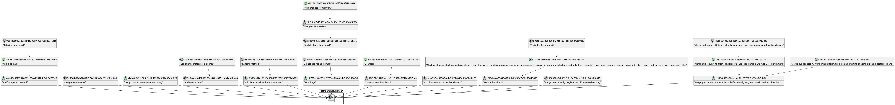

# Git repository visualizer

# Requirements:
 - Plantuml jar file specified in config
 - Rust toolchain

# Config
Configuration file is a csv file ([see example](./config/config.csv))

# Launch
Simply type `cargo run --release -- "path_to_your_config"` in this directory and wait for a bit

# Example of output
